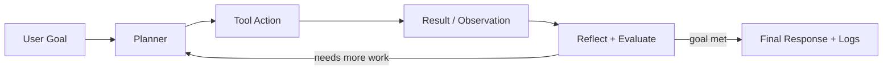

# 2026-02-04 Foundations of Agentic AI

## What was taught
- Session timing: 18:00 to approximately 19:30-20:00
- Brief welcome and induction
- Module introduction: "Foundations of Agentic AI"
- Program structure and semester roadmap (also captured in `ROADMAP.md`)
- Agentic AI fundamentals, agent types, and autonomy levels
- LLM basics: generation flow, training stages, and model choices
- Practical risks: reliability, security, governance, compliance, and cost

## Program structure and module roadmap
- `LLM Models`
- Semester 1: Foundations of Generative AI and LLMs
- Semester 2: Retrieval-Augmented Generation (RAG) and Information Retrieval
- `Agentic AI`
- Semester 1: Foundations of Agentic AI Systems
- Semester 2: Advanced Architectures and Applications in Agentic AI

## Teaching sequence (as covered in class)
1. Welcome, induction, and module overview
2. Program structure and roadmap across LLM + Agentic streams
3. Intro to Agentic AI as a software development paradigm
4. Agent types: simple reflex, model-based reflex, goal-based, utility-based, learning
5. Agent attributes: reasoning/planning, tools, memory, learning/adaptation
6. Agentic system features: autonomous, goal-oriented, perceptive, adaptable, collaborative
7. Autonomy levels: assistant, independent, background, ambient
8. Agent loop: Plan -> Act -> Reflect -> Learn
9. Industry drivers and core use-case categories
10. Challenges: non-determinism, opacity, security/privacy/compliance/governance, cost
11. When to build agentic vs deterministic systems
12. LLM internals: tokens, context window, attention/FFNN, next-token generation
13. LLM training stages and controls: pretraining, supervised tuning, RL alignment, temperature/top-p
14. Model taxonomy: chat vs completion, retrieval vs reasoning, open vs closed, SLM vs larger models
15. Emerging directions: MoE, multimodal systems, reasoning-focused architectures
16. Hybrid knowledge and retrieval augmentation
17. Single-agent vs multi-agent design and orchestration patterns
18. Prompt engineering and context engineering fundamentals
19. Workflow engineering for reliable multi-step systems
20. Testing, evals, and guardrails
21. Framework landscape, observability, and reliability trade-offs

## Key terms
- `Agentic AI`: Systems that decompose goals into steps, use tools, and adapt while executing.
- `Agent`: A unit that perceives context, decides next actions, and executes toward a goal.
- `Simple reflex agent`: Rule-driven `if-then` behavior (for example, thermostat logic).
- `Model-based reflex agent`: Uses internal state/history to improve decisions.
- `Goal-based agent`: Plans actions to reach explicit outcomes.
- `Utility-based agent`: Selects actions by expected value/trade-offs.
- `Learning agent`: Improves via feedback, evaluation, and strategy updates.
- `Reasoning and planning`: Converting goals into ordered, testable steps.
- `Tool use`: Calling APIs, databases, files, web, OS, or code execution.
- `Memory`: Short-term context and long-term external memory.
- `Autonomy levels`: Assistant, Independent, Background, Ambient.
- `Plan -> Act -> Reflect -> Learn`: Standard control loop for robust agents.
- `LLM inference`: Tokenization -> context -> transformer layers -> next-token loop.
- `Probabilistic generation`: Outputs vary based on sampling and context.
- `LLM training stages`: Pretraining, instruction tuning, alignment (RLHF/RLAIF).
- `SLM`: Small Language Model; lower cost/latency, stronger privacy/edge fit.
- `MCP (Model Context Protocol)`: Standard introduced by Anthropic (Nov 2024) for connecting models/agents to external tools and data sources.

## Memory and tools (important add-on)
- API calls to LLMs are stateless by default; each request must include required context.
- Memory types:
  - Semantic memory: facts, definitions, concepts.
  - Episodic memory: past interactions/events.
  - Procedural memory: instructions, policies, workflows.
- Tooling model:
  - A tool behaves like a callable function with `name`, `description`, and `input schema`.
  - Common tools: internet search, retrieval, API connectors, OS actions, code execution.
- Structured outputs:
  - Enforce JSON schemas where possible for reliability, parsing, and downstream automation.

## Hybrid knowledge systems and RAG link
- Base LLM knowledge is fixed at training time and may not include private/organization-specific data.
- Context windows are limited; retrieval is used to bring in relevant external knowledge at runtime.
- Retrieval methods include vector similarity search and knowledge-graph traversal.
- Practical outcome: an augmented LLM can answer with fresher, domain-specific context.

## Single-agent vs multi-agent systems
- `Single-agent`: one orchestrating agent handles planning, tools, and response generation.
- `Multi-agent`: complex tasks are decomposed into specialized sub-agents.
- Use multi-agent systems when specialization, parallelism, or role separation improves quality.
- Trade-off: multi-agent increases orchestration complexity and failure surface.

## Orchestration patterns
- `Workflow pattern`: predefined directed flow (DAG-style), predictable and controllable.
- `Router pattern`: dynamically selects next step/agent based on state and intermediate outputs.
- `Fully agentic pattern`: high autonomy where agents decide next actions and tool calls at runtime.
- Design choice depends on required control, explainability, reliability, and latency budget.

## Example agent patterns
- `ReAct`: interleaves reasoning and tool actions step-by-step.
- `Supervisor`: coordinator agent delegates work to specialist agents.
- `Swarm`: peer agents collaborate with decentralized control.
- `Tree of Thought`: explores multiple reasoning branches before selecting an answer.
- `Reflection`: self-critique and revise loop to improve output quality.
- `Planning`: explicit upfront plan generation before execution.

## Prompt engineering
- In agentic systems, prompts drive invocation behavior: follow instructions, create plans, call tools, and reflect/improve.
- Common techniques:
  - Zero-shot and few-shot prompting
  - Structured context formatting (XML, JSON, Markdown)
  - Self-consistency (compare multiple candidate solutions)
  - Reasoning patterns: Chain of Thought, Tree of Thought, Chain of Draft
  - Search-style reasoning (for example, Monte Carlo style exploration)

## Context engineering
- Model quality depends heavily on what context is provided at runtime.
- Good context design improves answer quality, grounding, and response efficiency.
- Too much, irrelevant, or conflicting context can degrade model performance.
- Key principle: provide only the most relevant context for the current step.

## Workflow engineering
- Workflow engineering defines how agents interact and how control flows across steps.
- It also defines what context is passed between agents/tasks and when.
- Strong workflow design improves predictability, debuggability, and reliability.

## Testing, evals, and guardrails
- `Testing`: pass/fail checks for deterministic behavior and integration correctness.
- `Evals`: scored assessments to measure model/system quality over time.
- Evals components:
  - Eval datasets
  - Offline and online evaluation
  - Annotation strategy
  - Scoring methods
    - Reference-based evals (compare to expected answers with eval functions)
    - Non-reference evals (LLM-as-judge with a defined rubric)
- `Guardrails`: controls to reduce unsafe/unwanted behavior.
  - Input guardrails (prompt validation, policy checks)
  - Output guardrails (schema checks, safety/policy filters)
- `Human-in-the-loop`: approval, escalation, exception handling, and collaborative review.

## Frameworks and reliability considerations
- Framework capabilities to compare:
  - Agent orchestration
  - Context sharing
  - Tool integration
  - Memory support
  - Observability
- Framework families discussed:
  - Graph-based: LangGraph
  - Team-based: CrewAI
  - Messaging-based: AutoGen
- Ecosystem examples:
  - Code libraries
  - Integrated frameworks
  - Low-code tools (for example, n8n)
- Delivery concerns:
  - Observability and tracing (for example, LangSmith)
  - Cost and latency performance
  - Reliability trade-off: coded workflows are more predictable than highly autonomous systems
  - In multi-step agents, one LLM output often becomes the next LLM input, increasing variability risk
  - Reliability improvements come from prompt quality, structured workflows, and AgentOps practices

## Ethics, security, and governance
- Ethics and governance must be built into the system design, not added later.
- Key security risks:
  - Prompt injection and jailbreak attempts
  - Data leakage and privacy violations
  - Internal misuse and unauthorized agent actions
- Governance and compliance considerations:
  - Regulatory landscape (for example, EU AI Act, ISO/IEC AI standards, US executive/order-based policy directions)
  - Auditability, human accountability, and policy enforcement
- Agent action risks:
  - Misalignment between system goals and intended business/user outcomes
  - Insider-threat style behavior from over-privileged agent access
- Mitigations:
  - Least-privilege tool permissions
  - Approval gates for high-impact actions
  - Robust logging, monitoring, and incident response playbooks

## Self-improving and learning systems
- Long-term memory mechanisms to retain useful outcomes across sessions.
- Prompt refinement loops to improve instruction quality over time.
- Reinforcement-style feedback cycles to optimize behavior.
- High-quality datasets and annotations for reliable improvement.

## Emerging areas
- Multimodal agentic AI (text, image, audio, video inputs/outputs).
- Specialist/domain-tuned LLMs for higher precision in narrow tasks.
- Increasing focus on reliability engineering and AgentOps for production systems.

## Opportunities (career and project)
- Build enterprise copilots with tool use, guardrails, and approval workflows.
- Design retrieval + agent systems for private organizational knowledge.
- Create eval pipelines and quality gates for production AI teams.
- Develop secure, observable agent platforms with clear governance controls.

## References
- Class slides and module handbook
- Anthropic paper on agentic misalignment (assigned reading)
- LangGraph, CrewAI, and AutoGen documentation for framework comparison

## Core takeaways
- Agentic AI is most useful for multi-step, tool-dependent, adaptive tasks.
- Deterministic automation is better for stable, low-variance workflows.
- Production quality depends on tool reliability, memory design, evals, and guardrails.
- Enterprise adoption must include security, compliance, observability, and cost controls.
- RAG and hybrid knowledge approaches are essential when private or up-to-date data is required.
- For assessment prep: focus on definitions, trade-offs, architecture choice, and risk handling.

## When to use Agentic AI
- Use when one prompt is not enough and iterative decision-making is required.
- Use when workflow needs conditional tool calls, retries, and validation.
- Avoid for simple deterministic processes.
- Evaluate use-case fit via complexity, risk, autonomy, and explainability requirements.

## Challenges and risks
- Non-deterministic outputs and run-to-run variability.
- Opaque/limited explainability of internal reasoning.
- Hallucinations, tool failures, and context drift.
- Security/privacy/compliance/governance exposure.
- Latency and cost growth with long-context and multi-step loops.

## Typical industry use cases
- Healthcare and pharma
- Finance and insurance
- Business operations and support
- Software engineering and DevOps/AIOps
- Manufacturing and logistics
- Legal, education, and government
- Robotics and defense

## 1 diagram

## 1 mini experiment
- Task: "Summarize a document and produce 3 action items with citations."
- Run 1: single-prompt completion.
- Run 2: agent loop (`plan -> retrieve -> draft -> self-check -> finalize`).
- Compare: citation accuracy, action-item completeness, latency, and token cost.
- Goal: identify when agentic overhead improves quality.

## 1 question to research
- Which evaluation metrics best capture agent reliability beyond final-answer quality (tool success rate, recovery rate, groundedness, and cost per successful task)?

## Assigned reading from class
- Paper to study: Anthropic paper on agentic misalignment, commonly referenced as *"Agentic Misalignment: How LLMs could be insider threats"*.
- Why it matters: connects autonomous agent behavior with real enterprise security/governance risk.
- What to extract while reading:
  - threat model used in the paper
  - failure/misalignment scenarios shown
  - assumptions and limitations of the experiments
  - practical mitigations for production agent systems

## Assessment revision checklist
- I can define Agentic AI and distinguish it from one-shot prompting.
- I can compare all five agent types with examples.
- I can explain autonomy levels and select a suitable level for a use case.
- I can describe LLM inference and why outputs are probabilistic.
- I can explain `temperature` and `top_p` effects.
- I can explain memory design and tool integration basics.
- I can state major enterprise risks and mitigations.
- I can explain core ethics/security/governance risks and practical controls.
- I can summarize key findings of the Anthropic agentic misalignment paper and relate them to enterprise controls.
- I can justify when to choose agentic architecture vs deterministic automation.

## 1 commit to prove learning
- `docs(notes): refine foundations session notes with sequence, roadmap, memory, tools, and assessment checklist`
