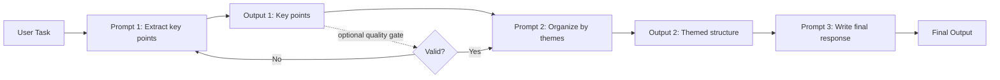
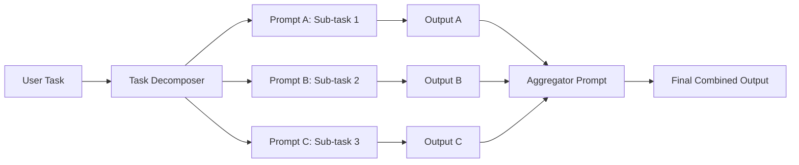
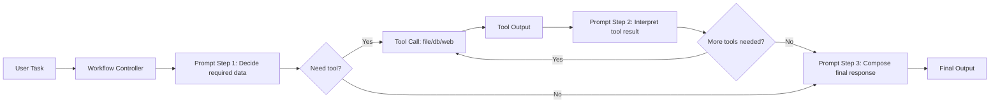

# 2026-02-17 Foundations in Agentic AI - Prompt Engineering for Agents (Andrew)

## Lecture objective

- Learn practical prompt engineering techniques for agentic systems.
- Understand when to use zero-shot, one-shot, few-shot, and instruction prompting.
- Apply structured prompting frameworks (CRAFT) for predictable output.
- Use reasoning prompts (CoT, ToT, DoT) for multi-step tasks.
- Connect prompting to workflows, tool use, and ReAct-style agent loops.

## Continuity with previous notes

- Builds on `notes/01-agentic-foundations/2026-02-04-foundations-agentic-ai.md`:
  - Extends the earlier `Plan -> Act -> Reflect -> Learn` mindset with concrete prompting methods that improve agent reliability.
  - Connects directly to earlier topics on autonomy levels, workflow engineering, and context engineering.
- Builds on `notes/01-agentic-foundations/2026-02-10-foundations-agentic-ai-model-api.md`:
  - Uses the same chat API concepts (`messages`, roles, token limits) but focuses on stronger prompt design.
  - Expands tool-calling from API mechanics to practical behavior patterns (prompt chaining, workflow with tools, ReAct loops).

## What was taught

- Prompt engineering is still experimental and model-dependent.
- Small prompt changes can lead to unpredictable behavior (prompt brittleness).
- Prompting quality improves through iteration, testing, and refinement.
- Prompting for agents must be more structured than basic chatbot prompts.
- Agent prompts act as control logic for multi-step behavior.

## Core prompt engineering principles

- Be clear and explicit.
- Define the expected output format (text, JSON, bullets, table, etc.).
- Set role/persona when it helps quality and tone.
- Add concrete examples for pattern learning.
- Limit task scope and split complex work into steps.
- Include all relevant context (do not assume runtime external knowledge).

## CRAFT framework

- `Context`: background and constraints.
- `Role`: who the model should act as.
- `Action`: exact task to execute.
- `Format`: structure/length/output shape.
- `Tone`: writing style and voice.

Practical takeaway:

- CRAFT gives a repeatable way to build prompts for class tasks, assessments, and agent workflows.
- Not every prompt needs all five parts, but each should be considered.

## Shot-based prompting

- `Zero-shot`: instructions only, no examples.
  - Best for common/easy tasks and fast experimentation.
- `One-shot`: one example before the real task.
  - Best when format/style needs light guidance.
- `Few-shot`: multiple examples (typically 2-5).
  - Best for consistency, domain-specific tasks, and structured outputs.

Best practice for few-shot:

- Keep examples realistic, short, and format-consistent.
- Ensure examples are accurate, because errors are learned as patterns.

## Instruction prompting

- Provide direct, explicit instructions using action verbs.
- For complex tasks, give a process-oriented sequence of steps.
- Prefer telling the model what to do (positive instructions) over long "do not" lists.

Use cases:

- Structured comparison tasks.
- Multi-step evaluation or feasibility analysis.
- Output that must follow numbered sections/tables/templates.

## Reasoning prompts

- `Chain of Thought (CoT)`:
  - Ask for step-by-step reasoning.
  - Useful for math, logic, planning, and decomposed decision tasks.
- `Tree of Thought (ToT)`:
  - Explore multiple paths, compare, then choose/synthesize.
  - Useful for strategy and trade-off problems.
- `Draft of Thought (DoT)`:
  - Generate draft -> critique/refine -> improved final output.
  - Useful for writing quality, persuasive text, and revision loops.
- Additional techniques mentioned:
  - `Self-consistency`
  - `Reflexion`
  - `Language Agent Tree Search (LATS)`

## Prompt chaining and workflows

- Prompt chaining:
  - Split large prompts into smaller linked steps.
  - Output of one step feeds the next step.
  - Improves controllability and debugging of intermediate results.
- Parallel prompts:
  - Run independent sub-tasks concurrently, then aggregate.
  - Useful for speed and answer comparison.
- Workflow pattern:
  - Fixed trajectory across defined steps.
  - More reliable than fully autonomous behavior for bounded tasks.

### Prompt chaining diagram

### Parallel prompts diagram

### Workflow with tools diagram

## Workflows with tools

- Tools can be inserted into workflows for controlled environment interaction.
- Typical tool-assisted retrieval:
  - File read
  - Document/RAG lookup
  - Internet search
  - Database query
- In structured workflows, the system often decides the sequence; model reasoning fills task details.

## Prompting for agents (ReAct orientation)

Why extra structure is needed:

- Agents operate over multiple turns, goals, tool calls, and state.
- Poor prompts cause incorrect or inconsistent action selection.
- Strong prompts improve planning, adaptation, and completion accuracy.

ReAct loop covered in class:

- `Thought -> Action -> Feedback/Observation -> Thought -> ... -> Final Answer`
- Tool outputs are appended to message history with `tool` role.
- Model infers what is done and what remains by reading context.

Core ReAct elements:

- `Thought`: reasoning about next step.
- `Action`: structured tool invocation.
- `Feedback`: tool output returned to context.
- `Answer`: final response once task is complete.

## Practical coding direction (as shown)

- Build tool schemas with Pydantic models.
- Pass tools via `pydantic_function_tool(...)`.
- Execute tool calls in loop until no `tool_calls` remain.
- Track execution with LangSmith tracing for observability.

High-level flow used in tutorial examples:

1. Define tool(s), such as `ReadFileTool`.
2. Call model with instruction + tool schema.
3. If tool call returned, execute and append `tool` message.
4. Repeat until assistant returns final non-tool answer.

## Exercises assigned/discussed

- Compare prompt techniques on SLMs (e.g., Qwen 0.6B) for reasoning quality.
- Progressively refine a domain prompt:
  - zero-shot -> few-shot -> CoT -> ToT.
- Extend ReAct example:
  - read multiple files in a folder
  - synthesize combined summary
  - design extra tool(s) for directory listing + file reading

## Key takeaways

- Match prompting technique to task complexity.
- High-quality examples can outperform longer instructions.
- Structured prompting is essential for reliable agent behavior.
- Break complex jobs into explicit steps/chains.
- Use tools and tracing to increase control and observability.
- Local SLMs are useful for learning technique limits; stronger LLMs often need less prompt scaffolding but still benefit from good structure.

## Common pitfalls

- Vague instructions and unclear success criteria.
- Inconsistent few-shot examples.
- Overcomplicating simple tasks.
- Missing output format constraints.
- Ignoring audience and tone requirements.

## Examples of important topics/concepts

- `Zero-shot prompting` example:
  - "Summarize this article in 3 bullet points for first-year computing students."
- `Few-shot prompting` example:
  - Provide 2-3 input/output examples, then ask the model to follow the same pattern for a new input.
- `Instruction prompting` example:
  - "Compare Docker vs VMs in a table with columns: Aspect, Docker, Virtual Machines. Then add a 100-word conclusion."
- `CRAFT` example:
  - Context: MSc lecture prep
  - Role: ML lecturer
  - Action: explain gradient descent
  - Format: bullet points + short summary
  - Tone: clear and beginner-friendly
- `Chain of Thought (CoT)` example:
  - "Solve this step by step and show intermediate calculations."
- `Tree of Thought (ToT)` example:
  - "Give 3 different approaches, evaluate pros/cons of each, then recommend one."
- `Draft of Thought (DoT)` example:
  - "Write a rough draft, critique it for clarity and tone, then provide an improved final version."
- `Prompt chaining` example:
  - Step 1: extract key points from source
  - Step 2: cluster points by theme
  - Step 3: produce final summary
- `Workflow with tools` example:
  - Tool 1 reads files, Tool 2 summarizes content; outputs are validated between steps.
- `ReAct loop` example:
  - Thought: identify required data
  - Action: call tool/API
  - Observation: parse tool output
  - Repeat until final answer is complete
- `Structured output` example:
  - "Return valid JSON with keys: `problem`, `approach`, `risks`, `next_steps`."

## References

- Anthropic - Building Effective Agents: `https://www.anthropic.com/engineering/building-effective-agents`
- IBM - Prompt Engineering Techniques: `https://www.ibm.com/think/topics/prompt-engineering`
- Wei et al. (NeurIPS 2022), "Chain-of-Thought Prompting Elicits Reasoning in Large Language Models": `https://arxiv.org/abs/2201.11903`
- Yao et al. (2023), "Tree of Thoughts: Deliberate Problem Solving with Large Language Models": `https://arxiv.org/abs/2305.10601`
- `/Users/swarajshaw/Downloads/3. Prompt Engineering for Agents.pdf`
- `/Users/swarajshaw/Downloads/Week 3 Tutorial - Prompt Engineering Tutorial (2).pdf`
