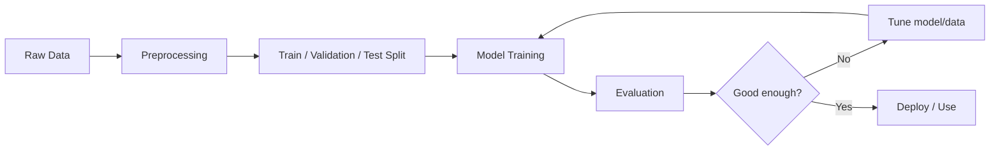

# 2026-02-26 LLM Foundations - Machine Learning (Abhishek Kaushik)

## Lecture objective

- Build a basic understanding of machine learning concepts used in AI/LLM systems.
- Understand how models learn from data instead of explicit rule-based programming.
- Connect ML fundamentals to later LLM topics (training, inference, evaluation).
- Summarize the concepts introduced in the professor's `Lecture 1.pdf` course material.

## Course material source

- Source used for these notes: `Lecture 1.pdf` (shared by Dr. Abhishek Kaushik)
- Extracted topics from slides include:
  - AI / ML / DL / DS distinctions
  - types of learning
  - ML components (representation, evaluation, optimization)
  - parametric vs non-parametric models
  - workflow, errors, evaluation, and applications

## What was taught

- Machine learning is a subset of AI where systems learn patterns from data.
- Traditional programming uses rules + data to produce outputs; ML uses data + outputs to learn rules (a model).
- Slide framing: "So what is ML?"
  - automating automation
  - getting computers to program themselves
  - writing software is the bottleneck
  - let the data do the work
- Deterministic vs ML/deep learning behavior:
  - Traditional rule-based systems are usually deterministic in nature (same input -> same output when rules are fixed).
  - Many ML/deep learning processes are stochastic in nature (training can vary due to randomness).
  - Deep learning models often start with randomly initialized weights.
  - Because of stochastic training and complex internal representations, exact outcomes can vary across runs.
- Fortune teller comparison (class analogy):
  - A fortune teller may appear accurate on familiar patterns/examples but fail on truly new situations.
  - Similarly, an ML model is not "intelligent" just because it fits past data well.
  - The real test is whether it can generalize to unseen data.
- "Magic? No, more like gardening" analogy from slides:
  - seeds = algorithms
  - nutrients = data
  - gardener = you
  - plants = programs/models
- Core ML workflow:
  - collect data
  - clean/preprocess data
  - split into train/validation/test sets
  - train a model
  - evaluate performance
  - improve and deploy
- Main learning types introduced:
  - supervised learning
  - unsupervised learning
  - semi-supervised learning
  - reinforcement learning (high-level mention)
- Inductive learning idea (from slides):
  - given examples of a function `(X, F(X))`
  - predict `F(X)` for new `X`
  - classification = discrete output, regression = continuous output
- Features and labels:
  - features = input variables
  - label/target = expected output in supervised learning
- Model training concepts:
  - loss/error measures how wrong predictions are
  - optimization updates model parameters to reduce loss
  - epochs and iterations repeat learning over data
- Generalization matters more than memorization.
- Deep learning "black box" concern:
  - internal decision-making is often hard to interpret directly
  - this makes debugging, trust, and explanation harder than simple rule-based systems
- Practical limitation highlighted:
  - we often cannot be 100% certain of predictions/results in ML systems
  - we measure confidence/performance probabilistically using evaluation on data
- Bias was discussed in the ML sense (not only social bias):
  - models make assumptions about patterns in data
  - these assumptions influence what they can learn well
  - too much wrong bias can cause underfitting
- Inductive bias (high-level idea):
  - every model has built-in preferences/assumptions
  - these biases help learning/generalization when they match the problem
- Overfitting vs underfitting:
  - overfitting learns training data too closely and performs poorly on new data
  - underfitting is too simple to capture patterns
- Good ML performance means balancing fit to training data with generalization to new data.
- Evaluation metrics depend on task type:
  - classification: accuracy, precision, recall, F1
  - regression: MAE, MSE, RMSE
- ML in a nutshell (slide):
  - many algorithms exist
  - each algorithm can be understood using 3 components:
    - representation
    - evaluation
    - optimization

## Definitions and distinctions (from slides)

- `AI`: Reproducing human intelligence in machines (learning, reasoning, self-correction).
- `ML`: Statistical tools/methods to learn from data.
- `DL`: Multiple nonlinear transformations to produce outputs.
- `Data Science`: Data processing, analysis, visualization for decision-making; intersects with AI but not necessarily a subset of AI.

## Core ML components (slide framework)

- `Representation` (how knowledge/pattern is represented)
  - decision trees
  - rules / logic programs
  - graphical models
  - neural networks
  - SVMs
  - ensembles
- `Evaluation` (how "good" the model is)
  - accuracy
  - precision / recall
  - squared error
  - likelihood / posterior probability
  - cost / utility
  - entropy / KL divergence
- `Optimization` (how model parameters/structure improve)
  - greedy search
  - gradient descent
  - constrained optimization / linear programming

## Types of learning (slide summary)

- `Supervised (inductive) learning`
  - training data includes desired outputs (labels)
  - examples: classification, regression
- `Unsupervised learning`
  - training data does not include labels
  - examples: clustering, association, dimensionality reduction
- `Semi-supervised learning`
  - some data labeled, most unlabeled
  - combines supervised + unsupervised techniques
- `Reinforcement learning`
  - learns from rewards over a sequence of actions

## Models (parametric vs non-parametric)

- `Parametric models`
  - fixed number of parameters/variables
  - often simpler and faster
  - can work with less data
  - example forms shown:
    - `Y = M X + C` (bias term highlighted in slides)
    - linear regression (`Y = B0 + B1*x`)
  - examples mentioned: logistic regression, perceptron
  - limitations:
    - constrained functional form
    - limited complexity
    - may fit poorly if assumptions are wrong
- `Non-parametric models`
  - fewer strong assumptions about mapping function
  - flexible functional form
  - examples mentioned: decision tree, support vector machine
  - benefits:
    - flexibility / power
    - can perform well on complex problems
  - limitations:
    - need more data
    - slower
    - higher overfitting risk

## Examples highlighted in slides

- `Linear Regression` (parametric)
  - linear relationship between input and predicted variable
  - preprocessing ideas listed:
    - remove noise
    - remove collinearity
    - rescale inputs
    - consider Gaussian distribution assumptions
- `CART / Decision Tree` (non-parametric)
  - Classification and Regression Trees
  - associated with Leo Breiman
  - split criterion mentioned: Gini index
  - greedy splitting methods
  - pruning effect / pruning

## Data analysis techniques (from slides)

- Descriptive: describe a dataset
- Exploratory: discover previously unknown relationships
- Inferential: test theories/general claims
- Predictive: use current/historical data to predict future events
- Causal: understand effect of changing one variable on another
- Mechanistic: exact variable changes for individual objects/systems

## ML in practice / workflow (slide summary)

- Understand domain, prior knowledge, and goals
- Data integration, selection, cleaning, preprocessing
- Learn models
- Interpret results
- Consolidate/deploy discovered knowledge
- Loop/iterate

## Why this matters for LLMs

- LLMs are also ML models trained on large datasets.
- Prompting works at inference time, but model capability comes from training.
- Understanding data quality, bias, and evaluation helps explain LLM behavior and limitations.
- LLMs can also look impressive like the "fortune teller" analogy if judged only on familiar examples.
- Generalization tests and evaluation on unseen tasks are important to judge real capability.
- LLMs also inherit deep learning traits: probabilistic outputs, black-box behavior, and non-zero uncertainty.

## Key terms

- `AI`: Broad field of building intelligent systems.
- `Machine Learning (ML)`: Learning patterns from data.
- `Model`: Mathematical function learned from data.
- `Training`: Process of updating model parameters.
- `Deterministic system`: Same input gives the same output under fixed rules/state.
- `Inference`: Using a trained model to make predictions.
- `Stochastic`: Involves randomness/probability (e.g., random initialization, sampling).
- `Feature`: Input signal used for prediction.
- `Label/Target`: Expected output value.
- `Loss function`: Measures prediction error.
- `Black box model`: A model whose internal reasoning is hard to interpret.
- `Bias (ML)`: Model assumptions that shape learning behavior.
- `Inductive bias`: Built-in preference/assumption that helps a model generalize.
- `Parametric model`: Model with a fixed number of parameters and stronger assumptions.
- `Non-parametric model`: More flexible model with fewer assumptions, often data-hungry.
- `Overfitting`: Poor generalization due to memorization.
- `Generalization`: Performance on unseen data.

## Important ML and DL terminology (with examples)

### Data and problem setup

- `Dataset`: Collection of examples used for learning.
  - Example: 10,000 rows of house prices with size, location, bedrooms.
- `Sample / Instance`: One row/example in a dataset.
  - Example: One house record (`1200 sq ft`, `2 BHK`, `price=55L`).
- `Feature`: Input variable used by the model.
  - Example: `study_hours`, `attendance`, `age`.
- `Label / Target`: Output to predict in supervised learning.
  - Example: `pass/fail` or `house_price`.
- `Class`: Category label in classification.
  - Example: `spam` vs `not spam`.
- `Ground truth`: Correct/actual label.
  - Example: Email actually marked as `spam` by human annotation.

### Data preparation

- `Preprocessing`: Cleaning and transforming data before training.
  - Example: Handling missing values and converting text to lowercase.
- `Normalization`: Scale values to a standard range (often 0 to 1).
  - Example: Height values scaled from `[150, 190]` to `[0, 1]`.
- `Standardization`: Center and scale data (mean 0, std 1).
  - Example: Exam scores transformed to z-scores.
- `Encoding`: Converting categorical values into numbers.
  - Example: `red/green/blue` -> one-hot vectors.
- `Train / Validation / Test split`:
  - `Train`: learn parameters
  - `Validation`: tune choices (hyperparameters)
  - `Test`: final unbiased evaluation
  - Example: `70/15/15` split.
- `Data leakage`: Information from test/future data accidentally enters training.
  - Example: Using the test-set mean to normalize training data.

### Learning types

- `Supervised learning`: Learn from labeled data.
  - Example: Predict diabetes from lab values.
- `Unsupervised learning`: Learn patterns without labels.
  - Example: Group customers by buying behavior (clustering).
- `Semi-supervised learning`: Small labeled set + large unlabeled set.
  - Example: 500 labeled images + 50,000 unlabeled images.
- `Reinforcement learning (RL)`: Learn actions using rewards.
  - Example: Game agent learns moves that maximize score.

### Model behavior and fit

- `Training`: Process of learning parameters from data.
  - Example: Updating weights over many epochs.
- `Inference`: Using trained model to predict.
  - Example: Classifying a new image as `cat`.
- `Generalization`: Performance on unseen data.
  - Example: Good test accuracy, not just training accuracy.
- `Overfitting`: Model memorizes training noise/details.
  - Example: `99%` train accuracy, `70%` test accuracy.
- `Underfitting`: Model too simple to learn true pattern.
  - Example: Linear model on a highly nonlinear problem.
- `Bias (ML)`: Error from overly strong assumptions.
  - Example: Fitting a straight line to curved data.
- `Variance`: Sensitivity to small changes in training data.
  - Example: Deep decision tree changes a lot with tiny data differences.
- `Bias-variance tradeoff`: Balance simplicity vs flexibility.
  - Example: Medium-depth tree often generalizes better than very shallow/deep.
- `Inductive bias`: Built-in assumptions helping a model learn.
  - Example: CNN assumes nearby pixels are related.

### Model and parameter terms

- `Parameter`: Learned value inside the model.
  - Example: Weight values in linear regression or neural network.
- `Hyperparameter`: Setting chosen before training.
  - Example: Learning rate, batch size, tree depth.
- `Weight`: Multiplier applied to inputs/signals in a model.
  - Example: In `y = wx + b`, `w` is a weight.
- `Bias term` (parameter): Additive constant in many models.
  - Example: In `y = wx + b`, `b` shifts the line.
- `Random initialization`: Starting weights chosen randomly before training.
  - Example: Two runs of same neural network start with different weights.
- `Deterministic`: Same input/setup produces same output.
  - Example: Fixed rule-based tax calculator.
- `Stochastic`: Includes randomness or sampling.
  - Example: SGD updates on random mini-batches.

### Optimization and training dynamics

- `Objective / Loss function`: What training tries to minimize.
  - Example: Cross-entropy for classification.
- `Cost function`: Aggregate loss over dataset (often same idea in class usage).
  - Example: Average MSE across all training examples.
- `Gradient`: Direction and rate of steepest increase of loss.
  - Example: Derivative tells how much a weight should change.
- `Gradient Descent (GD)`: Optimization using full dataset gradient.
  - Example: Update all weights after computing loss on all samples.
- `Stochastic Gradient Descent (SGD)`: Gradient update using one sample or mini-batch.
  - Example: Update weights every 32 samples.
- `Mini-batch`: Small batch of samples used per update.
  - Example: Batch size `32`.
- `Learning rate`: Step size for parameter updates.
  - Example: Too high `0.1` may diverge; `0.001` may be stable.
- `Epoch`: One full pass over training data.
  - Example: 20 epochs = model sees training set 20 times.
- `Iteration / Step`: One parameter update.
  - Example: With batch size 32, many iterations per epoch.
- `Convergence`: Training reaches stable/near-optimal loss.
  - Example: Validation loss stops improving much.
- `Local minimum` (informal intro): Suboptimal low-loss region.
  - Example: Training gets stuck in a decent but not best solution.

### Evaluation metrics

- `Accuracy`: Fraction of correct predictions.
  - Example: `90 correct / 100 = 90%`.
- `Precision`: Of predicted positives, how many are truly positive?
  - Example: Spam filter marks 20 mails as spam, 18 are truly spam -> precision `0.90`.
- `Recall`: Of actual positives, how many were found?
  - Example: 30 spam mails exist, model catches 18 -> recall `0.60`.
- `F1-score`: Harmonic mean of precision and recall.
  - Example: Useful when classes are imbalanced.
- `Confusion matrix`: Table of TP, FP, TN, FN counts.
  - Example: Evaluate where a binary classifier is making mistakes.
- `MAE`: Mean absolute error.
  - Example: Average house-price error = `₹2.5 lakh`.
- `MSE`: Mean squared error.
  - Example: Penalizes larger mistakes more than MAE.
- `RMSE`: Square root of MSE, in target units.
  - Example: Easier to interpret because same unit as price.

### Classical ML model terms

- `Linear Regression`: Predicts continuous output with linear relation.
  - Example: Predict salary from years of experience.
- `Logistic Regression`: Classification model producing class probability.
  - Example: Predict pass/fail from attendance and marks.
- `Decision Tree / CART`: Tree-based if/else splits.
  - Example: `attendance > 75%` then likely pass.
- `Gini Index`: Impurity measure used in tree splits.
  - Example: Split chosen to make child nodes purer.
- `Pruning`: Remove weak branches to reduce overfitting.
  - Example: Cut deep branches that fit only a few samples.
- `SVM (Support Vector Machine)`: Margin-based classifier/regressor.
  - Example: Separate spam and non-spam with a maximum-margin boundary.
- `Ensemble`: Combine multiple models for better performance.
  - Example: Random Forest combines many decision trees.

### Deep learning terms (core)

- `Neural Network (NN)`: Layered model of weighted computations.
  - Example: Input -> hidden layers -> output for image classification.
- `Neuron / Unit`: Single computational node in a network.
  - Example: Takes weighted inputs, applies activation.
- `Layer`: Group of neurons at the same stage.
  - Example: Input layer, hidden layer, output layer.
- `Input layer`: Receives feature values.
  - Example: Pixels of an image.
- `Hidden layer`: Intermediate learned representation layers.
  - Example: Detect edges/textures in images.
- `Output layer`: Produces final prediction.
  - Example: Probability of each digit `0-9`.
- `Activation function`: Nonlinear function applied after weighted sum.
  - Example: `ReLU`, `sigmoid`, `tanh`.
- `ReLU`: `max(0, x)` activation.
  - Example: Negative values become `0`, positive pass through.
- `Sigmoid`: Maps value to `[0, 1]`.
  - Example: Binary probability output.
- `Softmax`: Converts logits to class probabilities summing to 1.
  - Example: `cat=0.7`, `dog=0.2`, `car=0.1`.
- `Logit`: Raw output before softmax/sigmoid.
  - Example: `[2.1, 0.8, -1.4]` before probabilities.
- `Forward pass`: Compute predictions from inputs using current weights.
  - Example: Image -> logits -> predicted class.
- `Backpropagation`: Compute gradients layer-by-layer backward.
  - Example: Error signal flows from output layer to earlier layers.

### Deep learning regularization and stability

- `Regularization`: Techniques to improve generalization.
  - Example: L1/L2 penalty on large weights.
- `L1 regularization`: Adds absolute-weight penalty (can create sparsity).
  - Example: Some weights become near zero.
- `L2 regularization / Weight decay`: Penalizes large weights smoothly.
  - Example: Keeps weights smaller to reduce overfitting.
- `Dropout`: Randomly disable neurons during training.
  - Example: Drop `20%` of hidden units each step.
- `Early stopping`: Stop training when validation loss stops improving.
  - Example: Stop at epoch 12 instead of 50 to avoid overfitting.
- `Batch normalization` (intro): Normalize layer activations during training.
  - Example: Helps stabilize and speed up training in deep nets.

### DL architectures (high-level)

- `CNN (Convolutional Neural Network)`: Neural network specialized for grids/images.
  - Example: Image classification (cats vs dogs).
- `RNN (Recurrent Neural Network)`: Sequence model with recurrent state.
  - Example: Predict next character in text.
- `LSTM / GRU`: RNN variants for longer dependencies.
  - Example: Sequence modeling with less forgetting than plain RNN.
- `Transformer`: Attention-based architecture used in modern LLMs.
  - Example: GPT-style language models.
- `Attention`: Mechanism to focus on relevant tokens/features.
  - Example: In translation, model attends to aligned source words.

### Probabilistic outputs and uncertainty (important for LLMs)

- `Probability`: Model confidence estimate for outcomes.
  - Example: `P(pass)=0.82`.
- `Confidence` (informal): How sure the model seems to be.
  - Example: Softmax `0.95` for one class.
- `Uncertainty`: Not being fully sure of prediction correctness.
  - Example: Model predicts class A with `0.55`, class B with `0.42`.
- `Sampling`: Randomly choosing outputs based on probabilities.
  - Example: LLM can generate different next words across runs.
- `Temperature` (LLM inference): Controls randomness in token sampling.
  - Example: Lower temperature -> more deterministic outputs.

## 1 diagram

## 1 mini experiment

- Task: Predict student pass/fail from study hours and attendance.
- Steps:
  - Create a tiny table (10-20 rows) with `study_hours`, `attendance`, `pass_fail`.
  - Split into train/test manually.
  - Try a simple rule-based prediction ("fortune teller style" guessing from surface patterns), then compare with a basic ML classifier.
  - Repeat training with different random seeds/initialization (if using a neural model) and compare outputs.
  - Observe where the model succeeds/fails.
- Goal: See how features, labels, bias/assumptions, and generalization connect in practice.

## 1 question to research

- What is the difference between inductive bias, model bias (error decomposition), and social bias in ML/LLM discussions?

## 1 commit to prove learning

- `docs(notes): add 2026-02-26 LLM Foundations machine learning notes (Abhishek Kaushik)`
